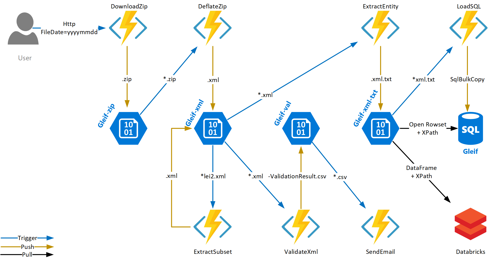

# GLEIF (multi GB Xml-handling)

This project demonstrates various processing approaches for handling large Xml files, using the publicly available LEI2 dataset.

## Architecture

## Projects

See [Data](./Data/Readme.md) for scripts used for downloading the Data from the public API endpoint, and uploading the files to the Data Lake Store.

See [ConsoleApp](./ConsoleApp/Readme.md) for the .NET Core CommandLineApp as a starting point for deriving some smaller files off the big Xml and lots of valuable .NET methods for Reading, Writing, Validating, Serializing Xml.

See [FunctionApp](./FunctionApp/Readme.md) for the Functions which are hosting the .NET Core snippets and which are (mostly) triggered by new Blob events

See [Database](./Database/Readme.md) for the T-SQL approaches

See [Databricks](./Databricks/Readme.md) for the Spark approaches

~~See [DataLake](./DataLake/Readme.md) for the U-SQL approaches~~ **-> outdated approach, use FunctionApp & Databricks instead**

## GLEIF

The Global Legal Entity Identifier Foundation (GLEIF) is tasked to support the implementation and use of the Legal Entity Identifier (LEI). The Legal Entity Identifier (LEI) enables **clear and unique identification of legal entities** engaging in financial transactions.

LEI data is a good open data source for demonstrating multi GB Xml-handling, while working with a valuable dataset. That is, because we believe in [*working software over comprehensive documentation*](http://agilemanifesto.org/)

## Data

Run [Download-LEI2.ps1](./Data/Download-LEI2.ps1) for downloading the 155 mb Zip file and extracting the 2.6 GB Xml file

About the LEI data format: [LEI Level 1 data CDF v2.1](https://www.gleif.org/en/about-lei/common-data-file-format/lei-cdf-format/lei-cdf-format-version-2-1)

About downloading the contatenated files: [gleif.org/gleif-concatenated-file](https://www.gleif.org/en/lei-data/gleif-concatenated-file/download-the-concatenated-file)
